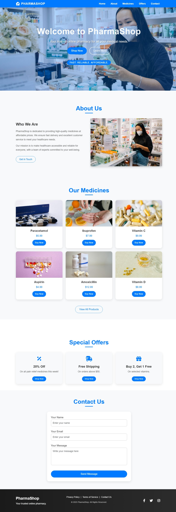

# pharmashop-online
PharmaShop: A responsive online pharmacy web application built with HTML, CSS, JavaScript, and Bootstrap, featuring product listings, offers, and a contact form.

# PharmaShop - Online Pharmacy Web Application

 <!-- Replace with a screenshot -->

PharmaShop is a modern, responsive web application designed as an online pharmacy platform. It allows users to browse medicines, view special offers, and contact support seamlessly. Built with HTML, CSS, JavaScript, and Bootstrap, this project showcases clean UI design, animations, and user-friendly features.

**[Live Demo](https://muzamal478.github.io/pharmashop-online/)**

## Features
- **Responsive Design**: Works seamlessly on desktop and mobile devices.
- **Dynamic Product Listings**: Displays medicines with prices and images using JavaScript.
- **Special Offers Section**: Highlights discounts and promotions.
- **Interactive Contact Form**: Validates user input and simulates submission.
- **Animations**: Smooth transitions and effects powered by Animate.css.
- **Professional UI**: Consistent theme with a pharmacy-inspired color scheme (blue, green, gray).

## Tech Stack
- **Frontend**: HTML5, CSS3, JavaScript
- **Framework**: Bootstrap 5
- **Animations**: Animate.css
- **Icons**: Font Awesome

## Project Structure
```
pharmashop-online/
├── index.html         # Main HTML file
├── css/
│   └── style.css      # Custom CSS
├── js/
│   └── script.js      # JavaScript logic
├── images/            # Image assets (e.g., logo.png, hero1.jpg)
└── README.md          # Project documentation
```

## Setup Instructions
1. **Clone the Repository**:
   ```bash
   git clone https://github.com/muzamal478/pharmashop-online.git
   ```
2. **Navigate to the Project**:
   ```bash
   cd pharmashop-online
   ```
3. **Open the Project**:
   - Open `index.html` in a web browser to view locally.
